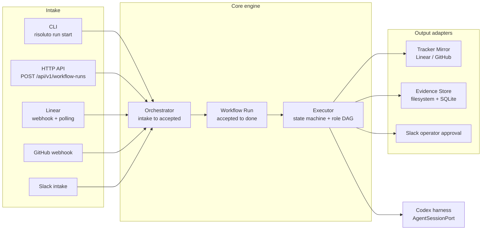

# Risoluto

[](https://github.com/risolutohq/risoluto/actions/workflows/ci.yml)
[](LICENSE)
[](package.json)

Risoluto is a workflow-run-centered background agent orchestration system for engineering work.

This repository is the public canonical v1 foundation for the product. It starts from a clean `0.1.0` baseline with useful backend/source code preserved, old git history excluded, and the web frontend/docs-site intentionally absent.

## Current Shape

- Primary product surface: CLI.
- Next first-class surface: TUI.
- Support/internal surface: HTTP API.
- Intake adapters: CLI, HTTP webhook, Slack, and tracker (Linear / GitHub) polling — each maps an Engineering Intent to a Workflow Run.
- Core primitive: Workflow Run.
- Planning source of truth: Linear, with selected public GitHub issue mirrors.



## Prerequisites

- **Node.js >= 22** and **pnpm 11** (the repo pins `pnpm@11.3.0`; `corepack enable` will provision it).
- **Docker** — required at runtime to spawn the sandbox containers that execute agent runs. Not needed to build or to run the unit suite.
- **(Contributors only)** the private `research/` submodule (`risolutohq/risoluto-research`) backs the research/planning pipeline (the `risoluto-*` agent skills), not the product build. See [AGENTS.md](AGENTS.md) for the full rule.

## Quickstart

```bash
git clone https://github.com/risolutohq/risoluto.git
cd risoluto
pnpm install
pnpm run build
```

Run the service (HTTP API + orchestrator):

```bash
./bin/risoluto            # equivalent to: node dist/cli/index.js
```

By default it listens on port **4000** and persists to `~/.risoluto` (override with `--port` and `--data-dir` / the `DATA_DIR` env var). When `MASTER_KEY` is not configured, it starts in **setup mode** — it logs a warning and serves the HTTP surface without starting the orchestrator until credentials are supplied. See [Configuration](#configuration).

For an auto-reloading dev loop without a build step, use `pnpm run dev` (runs the CLI through `tsx watch`).

## Usage

The CLI is the primary surface. Every command accepts `--json` for machine-readable output.

```bash
# Start the long-running service (orchestrator + HTTP API) on port 4000
risoluto
risoluto --port 8080 --data-dir ./data

# Start and drive a Workflow Run to completion
risoluto run start --title "Fix flaky test" --intent "Stabilise the retry-on-timeout case"
risoluto run start --title "..." --intent "..." --publish-mode draft --json

# Inspect a Workflow Run
risoluto run status <run-id> --json

# Show a Workflow Run's stored evidence (secret-classified fields redacted on display)
risoluto run evidence show <run-id> --json

# Validate workflow definitions in a directory (default: .risoluto/workflows)
risoluto workflow validate --workflow-dir ./.risoluto/workflows

# Check configuration and, with --live, run provider preflight probes
risoluto doctor
risoluto doctor --live
```

`run start` flags: `--title` and `--intent` are required; `--workflow-definition`, `--workspace-key`, `--workflow-dir`, `--data-dir`, and `--publish-mode` (`auto_merge` | `draft` | `incomplete_draft` | `none` | `ready`) are optional. Without live agent dispatch configured (`RISOLUTO_LIVE_RUN_START`), a run drives through the engine and stops at an honest block rather than spending on a model provider.

The `risoluto workflow-run …` subcommands are internal, agent-facing plumbing (event/attempt/transition bookkeeping); see [`src/cli/workflow-run-command.ts`](src/cli/workflow-run-command.ts).

> `./bin/risoluto` execs the compiled `dist/cli/index.js`, so run `pnpm run build` first (or `pnpm link --global` to put `risoluto` on your `PATH`).

## Configuration

Configuration is read from the environment. The table lists variable **names only** — never commit secret values.

| Variable                                                                                                                | Purpose                                                                      |
| ----------------------------------------------------------------------------------------------------------------------- | ---------------------------------------------------------------------------- |
| `DATA_DIR`                                                                                                              | Root data/persistence directory (default `~/.risoluto`).                     |
| `MASTER_KEY`                                                                                                            | Encryption key for the secrets store. Absent → service starts in setup mode. |
| `LOG_LEVEL`, `RISOLUTO_LOG_FORMAT`                                                                                      | Pino log level and output format.                                            |
| `LINEAR_API_KEY`, `LINEAR_PROJECT_SLUG`                                                                                 | Linear tracker intake/mirror. Absent → setup mode.                           |
| `SLACK_SIGNING_SECRET`                                                                                                  | Verifies inbound Slack requests for the Slack intake adapter.                |
| `OPENAI_API_KEY`, `RISOLUTO_DEFAULT_MODEL`                                                                              | Model provider key and default model profile for agent dispatch.             |
| `GITHUB_TOKEN`, `GITHUB_APP_ID`, `GITHUB_APP_INSTALLATION_ID`, `GITHUB_APP_PRIVATE_KEY` / `GITHUB_APP_PRIVATE_KEY_FILE` | GitHub access for PR publishing (PAT or GitHub App).                         |
| `RISOLUTO_BIND`, `RISOLUTO_TRUST_PROXY`                                                                                 | HTTP bind address and reverse-proxy trust.                                   |
| `RISOLUTO_READ_TOKEN`, `RISOLUTO_WRITE_TOKEN`                                                                           | HTTP API read/write auth tokens.                                             |
| `DISPATCH_MODE`, `DISPATCH_URL`, `DISPATCH_PORT`, `DISPATCH_SHARED_SECRET`                                              | Local vs. remote (data-plane) run dispatch.                                  |
| `SENTRY_DSN`, `RISOLUTO_OBSERVABILITY_DIR`                                                                              | Error tracking and observability output.                                     |
| `RISOLUTO_LIVE_RUN_START`                                                                                               | Opt in to live agent dispatch (incurs real model-provider spend).            |
| `RISOLUTO_PERSISTENCE`                                                                                                  | Deprecated no-op; SQLite is the only backend.                                |

## Docker

```bash
docker compose up --build            # service on :4000 (default profile)
docker compose --profile tunnel up   # + Cloudflare Tunnel sidecar
docker compose --profile full up     # + data-plane for remote dispatch (:9100)
```

The service mounts `/var/run/docker.sock` (it spawns sandbox containers) and exposes a healthcheck at `GET /api/v1/state`. Supply configuration through the environment (`MASTER_KEY`, `LINEAR_API_KEY`, `OPENAI_API_KEY`, `GITHUB_TOKEN`, …) — see [`docker-compose.yml`](docker-compose.yml).

## Development

Use Node.js 22 or newer and pnpm.

```bash
pnpm install
pnpm run build
pnpm run lint
pnpm run format:check
pnpm test
```

Useful focused checks:

```bash
pnpm run typecheck
pnpm run reach:check
pnpm run test:integration
pnpm run test:integration:live
pnpm run test:e2e
pnpm run test:load
pnpm run circular
```

## Foundation Docs

- [Product spine](docs/product-spine.md)
- [Technical spine](docs/technical-spine.md)
- [Decision register](docs/decisions.md)
- [Roadmap](docs/roadmap.md)
- [Research → shipping pipeline](docs/research-to-shipping-pipeline.md)
- [Testing & release](docs/testing-and-release.md)

## Contributing

See [CONTRIBUTING.md](CONTRIBUTING.md). Agent and working rules live in [AGENTS.md](AGENTS.md).

## What Is Not Here

The current web dashboard/frontend, docs-site, generated reports, runtime data, and private research corpus are not part of this v1 repository. The planning source of truth is the roadmap (`docs/roadmap.md`) together with Linear; there is no separate backlog document.

## License

Risoluto is released under the [MIT License](LICENSE).
