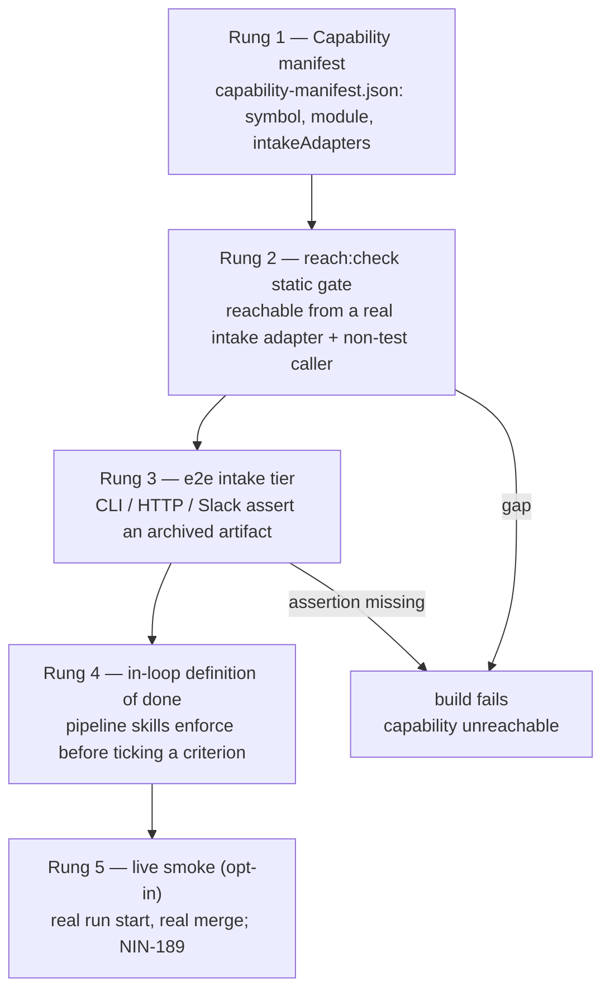

# The Reachability Ladder

A green v1 gate proves each module works _when something calls it_. It never proves anything actually
calls it from a real intake adapter. A capability can be implemented, tested, and merged as "done"
while reachable only from its own tests — an exported function with no production caller, or a caller
that computes a result and discards it. This happened during the workflow-first-afk-mvp build (12
capabilities shipped green-but-dead; see the `from:prd-workflow-first-afk-mvp` reachability issues).

The ladder is the standing defense against that regression class. Each rung is stronger and slower than
the one below; a capability is only "shipped" when it clears the rungs that apply to it.

## Rungs

1. **Capability manifest** — `src/reachability/capability-manifest.json`. Each entry declares a
   load-bearing capability: its `symbol`, the `module` that exports it, and the `intakeAdapters`
   (`cli` / `http` / `slack`) it must be reachable from. Schema + validator: `src/reachability/capability-manifest.ts`; disk reader: `src/reachability/manifest-file.ts`.

2. **`reach:check` static gate** — `pnpm reach:check` (`scripts/reachability-check.ts`). Builds the real
   import graph (madge) + a call-site scan and asserts every manifested capability is reachable from a
   declared adapter _and_ has a non-test caller. Verdicts: `reachable`, `no-nontest-caller`,
   `module-unreachable`, `dead-export`, `deferred`. It is wired into the **canonical v1 gate** (AGENTS.md
   §Verification gate + the `/v1-check` skill) as a fast read-only step, and into **CI** (the `quality`
   job) — a gap fails the build, it is not a warning. A green test suite is not reachability.

3. **e2e tier** — `pnpm test:e2e` (`vitest.e2e.config.ts`, `tests/e2e/`). Drives each intake adapter
   end to end against the real surface, faking only true externals, and asserts an **archived artifact
   or event** — never an internal function call. Covers CLI `run start` (`cli-run-start.e2e.test.ts`),
   HTTP webhook (`http-webhook.e2e.test.ts`), and Slack (`slack-intake.e2e.test.ts`), including
   signature rejection + replay dedup. Wired into CI as the `e2e` job (push + PR).

4. **In-loop definition of done** — the pipeline skills enforce the bar _before_ a Linear criterion is
   ticked, not just in CI: `risoluto-tdd` (a manifest entry + green `reach:check` + an intake-adapter
   e2e are required to tick), `risoluto-to-issues` (every capability-bearing slice carries a
   reachability acceptance criterion), `risoluto-review-handoff` (the lens names the manifest entry +
   the e2e for each shipped capability).

5. **Live smoke (top rung, gated)** — a real `run start` → real agent session → real council verdict /
   real auto-merge on the sandbox repo. **Opt-in only**: the live suites (`tests/integration/live/`)
   skip unless `RISOLUTO_LIVE_RUN_START=1` and the live credentials are present; the CI `live-smoke` job
   runs **only** on `schedule` / `workflow_dispatch`, never on normal push/PR. It costs real tokens and
   mutates a real sandbox repo, so it is never in the fast loop. Full real-execution hardening (codex
   agent exec, real PR merge, minutes-scale timeout) is tracked by NIN-189.

## Audit baseline

`reach:check` passes with **13/13 capabilities reachable, 0 gaps** as of the verification-ladder build —
the seeded manifest is the real audit, covering run-status lifecycle + inbound parse, evidence display,
HTTP-create drive, workflow-level status mapping, tracker polling reconcile, verifier decision routing,
intake rule evaluation, unanswered-clarification timeout, attempt-memory + project-memory candidate,
post-publish reconfirm, council verifier dispatch, and auto-merge completion. The manifest is the
source of truth for the list.

## Proof the ladder bites (the dangerous negatives)

The ladder is only worth its cost if it fails on the bad cases — these are asserted, not assumed:

- **`reach:check` bites.** `tests/reachability/reach-check.test.ts` — "exits non-zero and names the
  capability and missing link when one is unreachable" + "surfaces a fully-dead export via the
  dead-export reason". `tests/reachability/analyzer.test.ts` — a `no-nontest-caller` gap when a symbol
  is exported but never called from production, and test-only wiring flagged as a gap naming the test
  callers. Remove the production caller of a manifested capability and the gate goes non-zero.

- **The e2e tier bites.** `tests/e2e/http-webhook.e2e.test.ts` — "bites: intake without event-bus
  wiring archives intent.v1 but leaves review.v1 absent": stub the intake→engine wiring and the asserted
  archived effect disappears, failing the e2e. Because the e2e assertions target archived
  artifacts/events (not internal calls), a discarded-result capability cannot pass.

- **The live rung is gated, not skipped silently.** The live suites use `describe.skipIf` on
  `RISOLUTO_LIVE_RUN_START`; CI gates the `live-smoke` job on `schedule`/`workflow_dispatch`.
