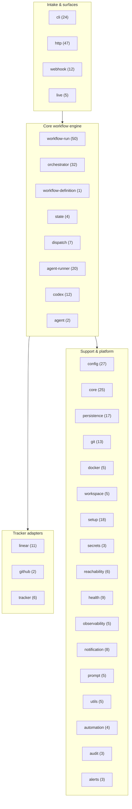

# Risoluto — Technical Spine

> The v1 technical spine is **maximal** — it names every layer Risoluto's foundation must
> accommodate, even where v1 ships only a partial implementation. The spine governs source
> classification and boundary discipline: kept code maps to a surface here, or it is removed /
> deferred through the [roadmap](./roadmap.md), [decisions](./decisions.md), or Linear. For the
> as-built status of each surface, see [`adr/0001-foundation.md`](./adr/0001-foundation.md).

## Spine surfaces

1. **Core workflow engine** — Workflow Run lifecycle, transitions, gate evaluation.
2. **Workflow Run model** — durable, retryable, replayable execution record.
3. **Workflow Definition model** — reusable state-machine / graph template.
4. **State machine with graph execution inside states** — outer states sequential; intra-state Role Execution is a typed DAG.
5. **Role Execution runtime** — invokes an Agent Role, wires its harness / worker / model, collects artifacts.
6. **Typed Artifact Contracts** — schemas for the artifacts roles produce and consume.
7. **Durable artifact + raw evidence storage** — both the structured artifact and the raw harness-native record.
8. **Event-sourced Run Log with policy** — live state projected from the log; retention, redaction, export.
9. **Memory Builder + Memory Manager** — defined; Attempt Memory implemented first.
10. **Hooks, Gates, and Transitions as separate concepts.**
11. **Tracker Adapters** — Linear / GitHub Issues / GitLab / Jira behind one contract.
12. **Board Projection Contract** — tracker board semantics exposed by adapters; v1 documents the contract only.
13. **PR / MR Adapters** — GitHub / GitLab.
14. **Harness Adapters** — Codex, Claude Code, Cursor, custom.
15. **Model / provider configuration** — explicit / name-based first.
16. **Versioned skill packs** — product artifacts; live in the main repo first.
    > **Build-time operator tooling (not a runtime layer):** `research/wiki/` (the connected
    > knowledge wiki) and the `/risoluto-ingest` skill (wiki builder + gap-grounded idea engine)
    > are planning surfaces that feed the roadmap funnel. They run at the operator's discretion
    > and have no presence in the execution stack above.
17. **Scheduler / retry / concurrency** — for Workflow Runs and Role Executions.
18. **Control plane / execution plane split** — single-node first, architecture portable.
19. **Observability** — audit, replay, export, metrics, trace.
20. **CLI** — the primary interface.
21. **TUI** — the next first-class interface.
22. **HTTP API** — support / internal surface, not the primary product surface.

## Layering

```
+--------------------------------------------------------------+
|  Operator Surfaces                                           |
|    CLI (primary)   TUI (next)   HTTP (internal/support)      |
+--------------------------------------------------------------+
|  Intake & Mirror                                            |
|    Tracker Adapters   PR/MR Adapters   Webhook + Polling     |
+--------------------------------------------------------------+
|  Core Workflow Engine                                       |
|    Workflow Run · Workflow Definition · State Machine ·      |
|    Transitions · Gates · Hooks · Scheduler · Retry · Memory  |
+--------------------------------------------------------------+
|  Role Execution Runtime                                     |
|    Agent Roles · Role Execution · Typed Artifact Contracts · |
|    Harness Adapters · Model/Provider Config · Skill Packs    |
+--------------------------------------------------------------+
|  Persistence & Evidence                                     |
|    Artifact Store · Raw Evidence Store · Event-Sourced Log · |
|    Memory Store · Redaction & Export Policy                  |
+--------------------------------------------------------------+
|  Control Plane  /  Execution Plane Split                    |
|    (single-node default; portable to customer-controlled)    |
+--------------------------------------------------------------+
|  Observability                                              |
|    Audit · Replay · Export · Metrics · Trace                 |
+--------------------------------------------------------------+
```



## Boundary rules

- **Ports are the contract.** Tracker / harness / PR / model integrations live behind typed ports. Code that reaches around a port (e.g. calling `LinearClient` straight from the orchestrator) is wrong.
- **Plane separation.** Control-plane code never assumes execution-plane locality; execution-plane code never assumes control-plane authority over secrets. The seam is `src/dispatch/` (`RunAttemptDispatcher`: local `AgentRunner` vs remote `DispatchClient`); the run state machine lives in `src/state/` + `src/workflow-run/executor.ts`.
- **Hooks ≠ Gates ≠ Transitions.** A hook is a side-effect / extension point, a gate is a proof requirement, a transition is a state change. Same execution context, different concepts, separate code paths.
- **Skill packs are versioned and discoverable** through one registry contract, whether in-tree (v1) or out-of-tree (post-v1).
- **No external plugin API in v1.** Plugin boundaries exist in the type system; the public extension surface is deferred.

## Adapter surfaces (v1 contracts, not full implementations)

| Surface          | v1 contract                                                                                                | v1 implementation                        |
| ---------------- | ---------------------------------------------------------------------------------------------------------- | ---------------------------------------- |
| Tracker          | `TrackerPort` (intake, mirror, board projection)                                                           | Linear (first), GitHub Issues (shipped)  |
| PR / MR          | `GitPostRunPort` / `GitIntegrationPort` (commit-push, open PR, status, diff)                               | GitHub PRs                               |
| Harness          | `AgentSessionPort` (start session, collect artifacts, stream evidence)                                     | Codex (first)                            |
| Model / provider | `CodexProviderConfig`                                                                                      | Anthropic, OpenAI (explicit, name-based) |
| Persistence      | `AttemptStorePort`, `WorkflowRunArchive` (event log), `WorkflowRunEvidenceStore`, `WorkflowRunMemoryStore` | SQLite + filesystem (single-node)        |

GitHub Issues ships as a second tracker adapter (`src/tracker/github-adapter.ts`, selected when the
tracker kind is `github`); Linear stays the default and most complete. Other tracker / PR / harness
implementations are [roadmap](./roadmap.md) work. The full v1 out-of-scope list lives in the
[Product Spine](./product-spine.md#what-v1-does-not-implement) — it is not restated here.

## Related docs

- [Product Spine](./product-spine.md) — what Risoluto is and the canonical terms.
- [ADRs](./adr/) — the foundational technical decisions, with as-built status tables.
- [Decisions](./decisions.md) — chronological log of everything else.
- [Testing & Release](./testing-and-release.md) — how spine surfaces get covered and the `1.0.0` gate.
- [Roadmap](./roadmap.md) — the single ordered plan of what's next.
- [Research-to-Shipping Pipeline](./research-to-shipping-pipeline.md) — how research (Mode A targeted / Mode B ingest) feeds roadmap rows through PRD → issues → TDD → merge.
